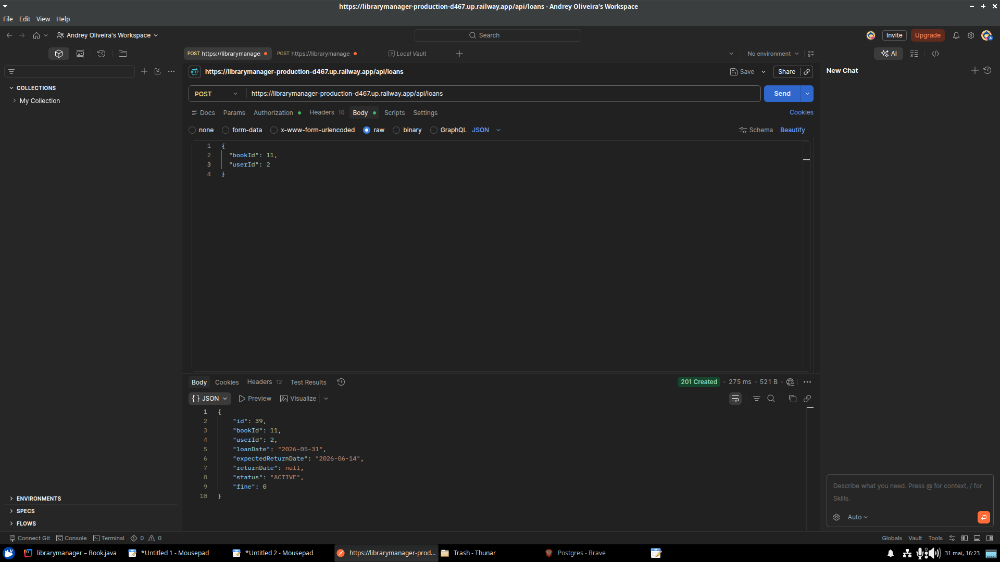
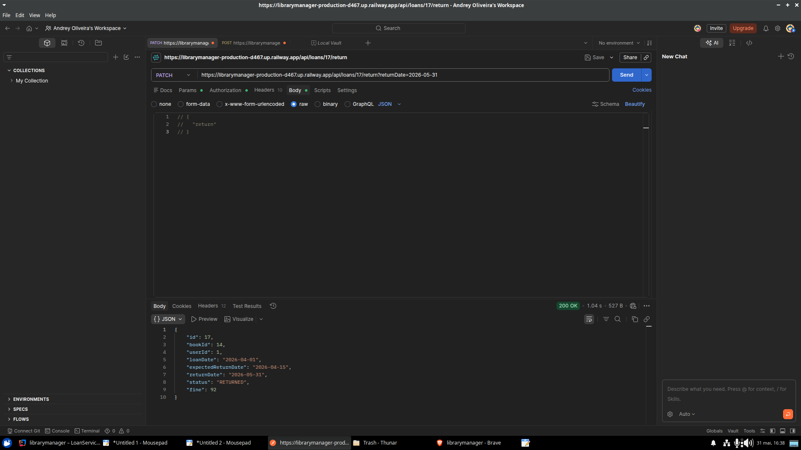
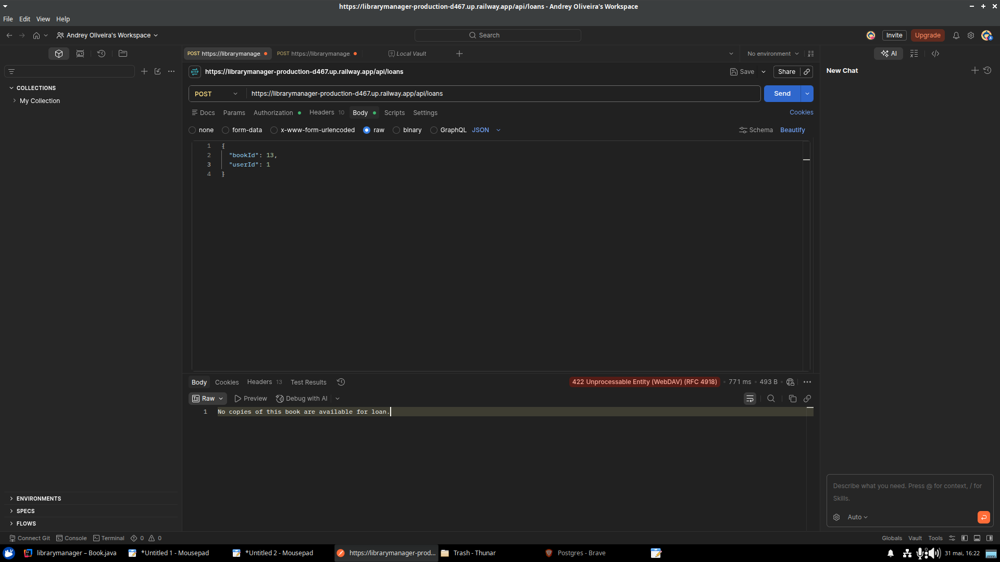
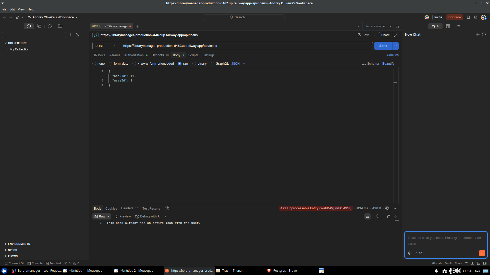
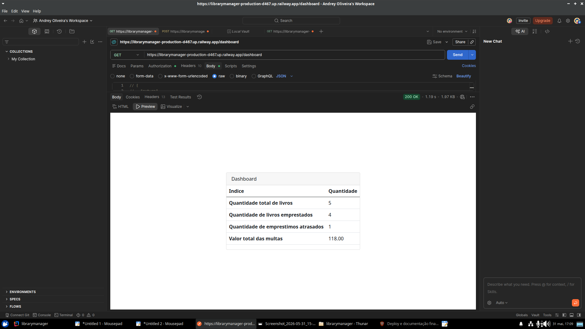
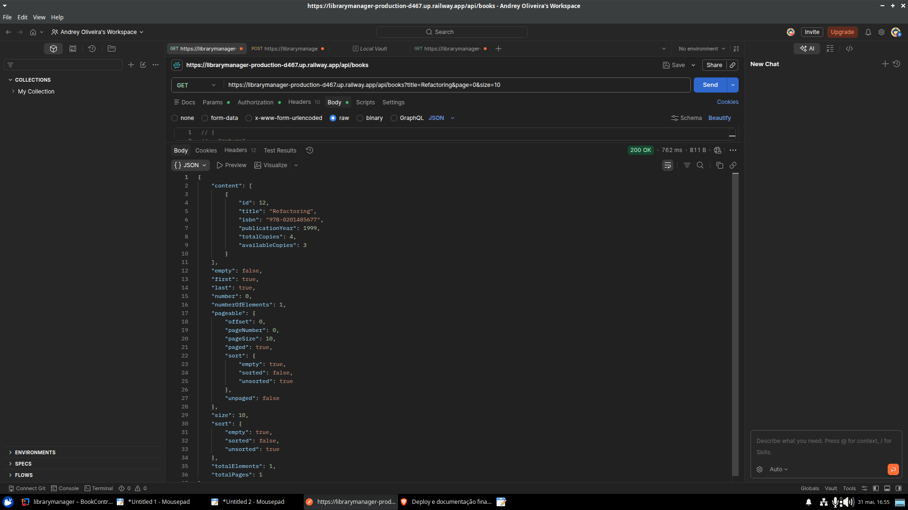

# librarymanager

  

<h1 align="center">Library Manager</h1>

  
  
  

  <strong>API REST estratégica para gestão de acervos, desenvolvida com TDD (Test-Driven Development) e foco em regras de negócio complexas.</strong>

  🚀 <strong>Link do Deploy:</strong> <a href="https://librarymanager-production-d467.up.railway.app" target="_blank" rel="noopener noreferrer">Acesse o Sistema no Railway</a>

---

### 🔍 Visão Geral
O **Library Manager** não é apenas um CRUD. É um sistema robusto de controle de circulação de livros que gerencia desde a disponibilidade de exemplares até o cálculo rigoroso de multas por atraso. O projeto foi construído sob a metodologia de **Design Incremental**, onde cada funcionalidade foi guiada por testes automatizados antes de sua implementação em produção.

### 📸 Prova Visual de Regras de Negócio
Abaixo, demonstro a integridade da API através de evidências visuais coletadas durante os testes de integração em produção:

#### 1. Ciclo de Empréstimo e Devolução
| Sucesso no Empréstimo (201) | Devolução com Cálculo de Multa (200) |
| :---: | :---: |
|  |  |
| Registro de empréstimo com data prevista de 14 dias. | **Prova Técnica:** Multa calculada de R$ 92,00 por atraso persistida no banco. |

#### 2. Validações de Segurança e Negócio (Fail-Fast)
| Tentativa de Livro Indisponível (422) | Empréstimo Duplicado (422) |
| :---: | :---: |
|  |  |
| API impede a saída de livros sem cópias no estoque. | Bloqueio de segundo empréstimo do mesmo livro para o mesmo usuário. |

#### 3. Relatórios e Gestão Visual
| Dashboard Estratégico (Thymeleaf) | Filtros de Busca Avançados |
| :---: | :---: |
|  |  |
| Consolidado de multas e status geral da biblioteca. | Busca dinâmica por título e autor via JPA Specification. |

---

### 🧠 Decisões Técnicas e Trade-offs
Esta seção justifica o raciocínio por trás da arquitetura escolhida, demonstrando pensamento crítico sobre a stack:

*   **TDD (Test-Driven Development):** Adotei o TDD estrito para garantir que 100% das regras de negócio (como o decremento de cópias e o cálculo de multas) fossem validadas antes de existirem no serviço. Isso reduziu o tempo de debug em produção drasticamente.
*   **JPA Specification vs. Query Methods:** Rejeitei a abordagem de métodos derivados no Repository (ex: `findByTitleAndAuthorAndAvailable`) pois ela causa uma "explosão" de métodos difíceis de manter. Optei por **JPA Specification**, permitindo que o cliente da API combine filtros de forma dinâmica e escalável com uma única implementação.
*   **Tratamento de Exceções (404 vs 422):** Implementei um `GlobalExceptionHandler` para diferenciar erros de infraestrutura de erros de negócio. Enquanto recursos não encontrados retornam **404**, violações de regras de biblioteca retornam **422 (Unprocessable Entity)**, fornecendo feedback semântico claro para o integrador.
*   **Estratégia de Autenticação:** Escolhi **Spring Security com JWT (Stateless)** em vez de sessões tradicionais para garantir que a API possa escalar horizontalmente, mantendo a segurança via Bearer Tokens em todas as rotas de escrita.

---

### 👨‍💻 Autor
**Andrey Oliveira**
Especialista em Desenvolvimento Java/Spring Boot.

---
*Este projeto foi licenciado sob a [MIT License](LICENSE).*