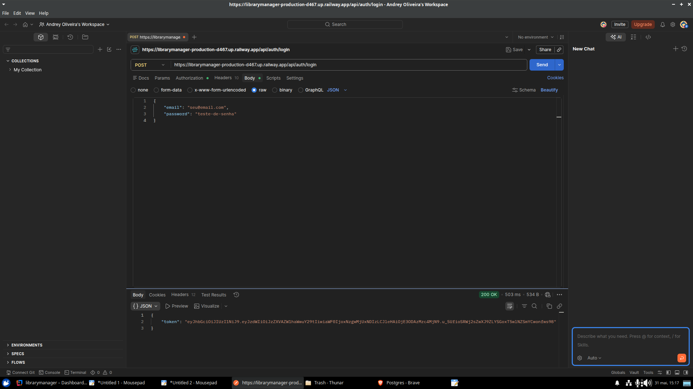

# librarymanager
<p align="center">
  
</p>

<h1 align="center">Library Manager</h1>

<p align="center">
  
  
  
  
</p>

<p align="center">
  <strong>API REST para gestão de bibliotecas pessoais desenvolvida com foco extremo em qualidade de código através de TDD (Test-Driven Development) e Design Incremental.</strong>
</p>

---

### 📝 Índice
- [Visão Geral](#-visão-geral)
- [Funcionalidades](#-funcionalidades)
- [Demonstração](#-demonstração)
- [Decisões Técnicas e Aprendizados](#-decisões-técnicas-e-aprendizados)
- [Stack Tecnológica](#-stack-tecnológica)
- [Como Executar](#-como-executar)
- [Documentação da API](#-documentação-da-api)
- [Autores e Licença](#-autores-e-licença)

---

### 🔍 Visão Geral
O **Library Manager** resolve o problema de organização de acervos físicos, permitindo o controle rigoroso de empréstimos, devoluções e multas. O projeto foi construído para demonstrar maturidade técnica em relacionamentos complexos de banco de dados e regras de negócio sólidas, garantindo que nenhum código de produção fosse escrito sem um teste de falha prévio.

### 🚀 Funcionalidades
- **Gestão de Acervo:** CRUD completo de livros e autores com relacionamento Many-to-Many.
- **Filtros Avançados:** Busca de livros por título, autor e disponibilidade via JPA Specification.
- **Controle de Empréstimos:** Sistema inteligente que verifica disponibilidade de cópias e impede empréstimos duplicados do mesmo livro para o mesmo usuário.
- **Cálculo de Multas:** Processamento automático de multas de **R$ 2,00 por dia** de atraso na devolução.
- **Dashboard Estratégico:** Visão geral com total de livros, empréstimos ativos, atrasados e valor total de multas pendentes.
- **Segurança:** Autenticação via **JWT (JSON Web Token)**, garantindo que usuários acessem apenas seus próprios dados.

### 📸 Demonstração
#### Painel de Controle (Dashboard)
Abaixo, a interface desenvolvida com Thymeleaf e Bootstrap 5 que consolida os dados da biblioteca:
<p align="center">
  
</p>

#### Fluxo de Autenticação e Empréstimo
Testes de integração realizados via Postman garantindo a integridade dos endpoints:
<p align="center">
  
  
</p>

### 🧠 Decisões Técnicas e Aprendizados
Esta seção demonstra o **pensamento crítico** aplicado durante o desenvolvimento:
1. **Abordagem TDD:** O ciclo "Red-Green-Refactor" foi utilizado em todos os serviços. Isso permitiu identificar falhas de lógica antes mesmo da implementação, como o controle de decremento de cópias disponíveis.
2. **Tratamento de Exceções Customizado:** Implementação de um `GlobalExceptionHandler` para mapear erros de negócio para o status HTTP **422 (Unprocessable Entity)** e recursos não encontrados para **404 (Not Found)**.
3. **Segurança Stateless:** A escolha por JWT em vez de sessões tradicionais permite que a API seja escalável e siga os princípios REST de forma rigorosa.
4. **JPA Specification:** Utilizada para criar filtros dinâmicos e reutilizáveis, evitando a explosão de métodos no repositório.

### 🛠 Stack Tecnológica
- **Linguagem:** Java 21
- **Framework:** Spring Boot 4.x
- **Banco de Dados:** PostgreSQL (Produção) e H2 (Testes)
- **Segurança:** Spring Security + JWT (JJWT 0.12.x)
- **Frontend:** Thymeleaf + Bootstrap 5
- **Documentação:** SpringDoc OpenAPI
- **Produtividade:** Lombok e Bean Validation

### ⚙️ Como Executar
#### Pré-requisitos
- Java 21 ou superior
- Maven
- PostgreSQL configurado

#### Passo a passo
1. Clone o repositório:
   ```bash
   git clone https://github.com/Andrey479/librarymanager.git
   ```
2. Configure as variáveis de ambiente:
   - `DB_PASSWORD`: senha do seu banco PostgreSQL.
   - `JWT_SECRET`: uma chave de pelo menos 32 caracteres para assinatura dos tokens.
3. Execute a aplicação:
   ```bash
   mvn spring-boot:run
   ```
4. O dashboard estará disponível em: `http://localhost:8080/dashboard`.

### 📡 Documentação da API
Os principais endpoints estão protegidos por autenticação Bearer Token:
- `POST /api/auth/login`: Realiza login e retorna o token JWT.
- `GET /api/books`: Lista livros com paginação e filtros opcionais.
- `POST /api/loans`: Registra um novo empréstimo.
- `PATCH /api/loans/{id}/return`: Realiza a devolução e calcula multas.
- `GET /api/loans/most-borrowed`: Relatório de popularidade do acervo.

### 👨‍💻 Autores e Licença
Desenvolvido por **Andrey Oliveira (Andrey479)**.
Este projeto está sob a licença **MIT**.