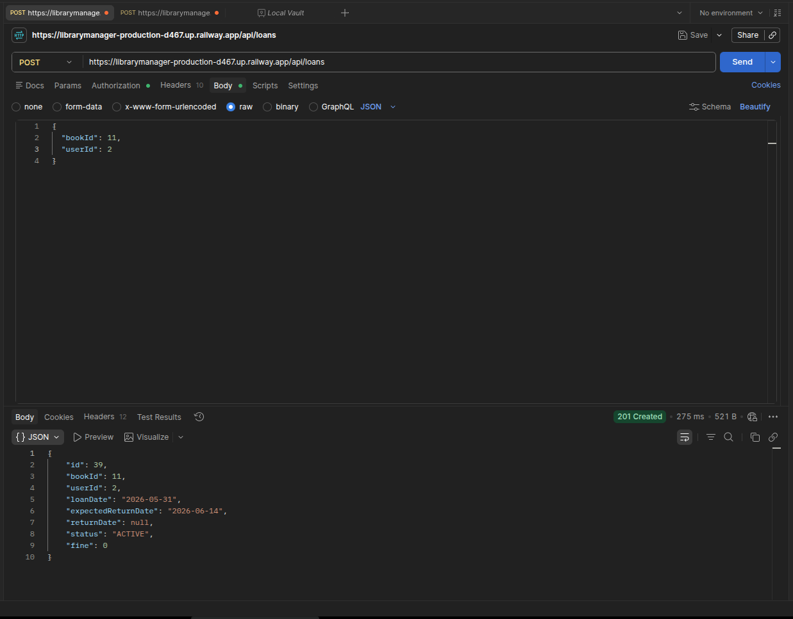
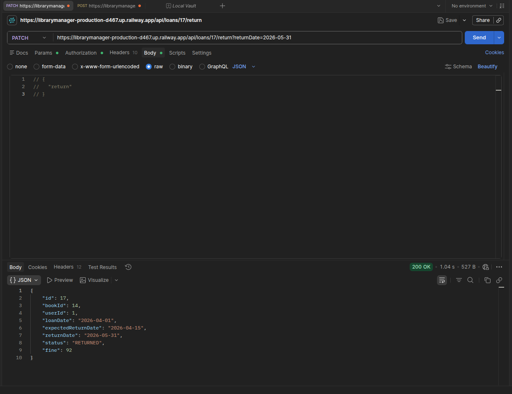
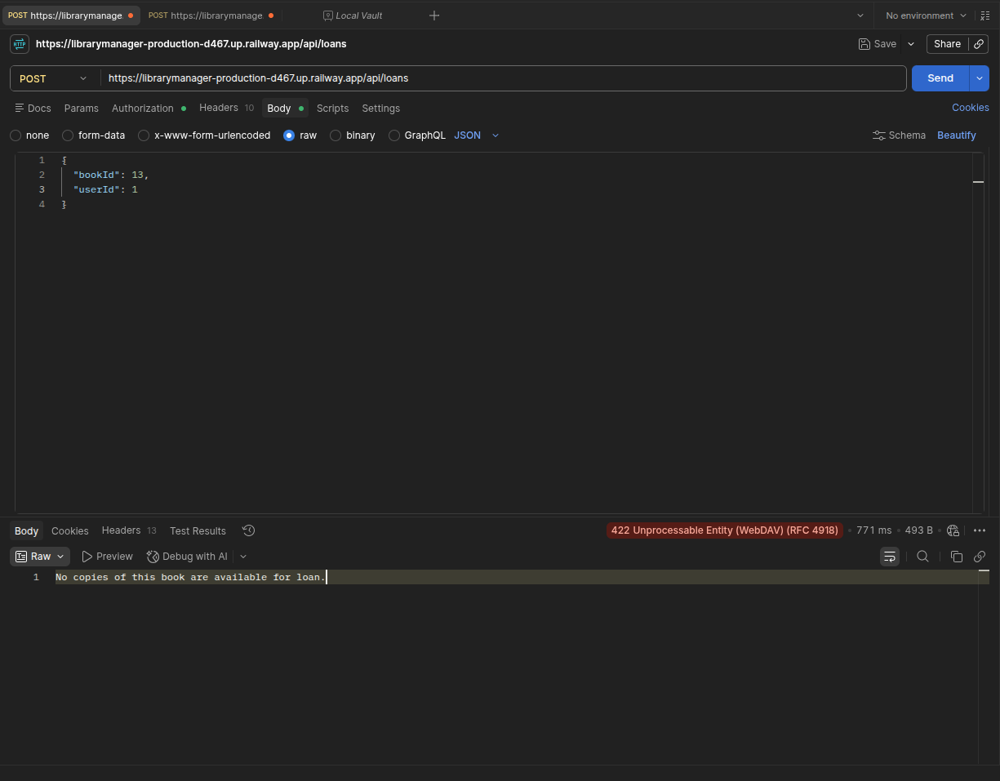
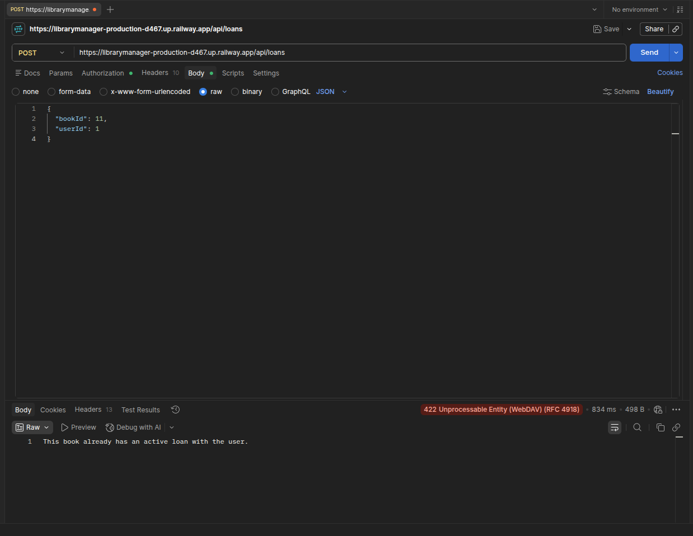
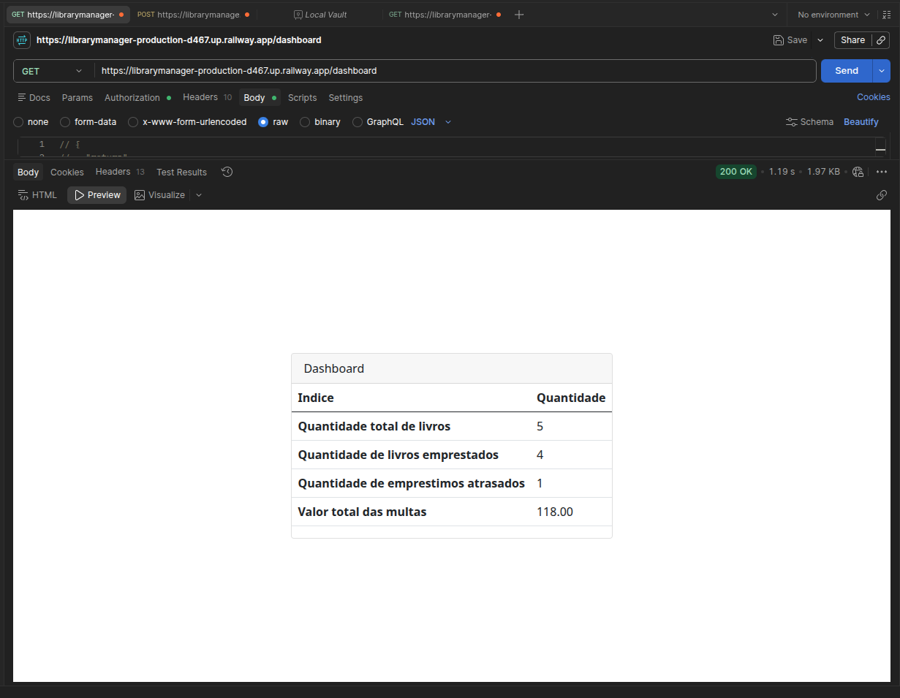
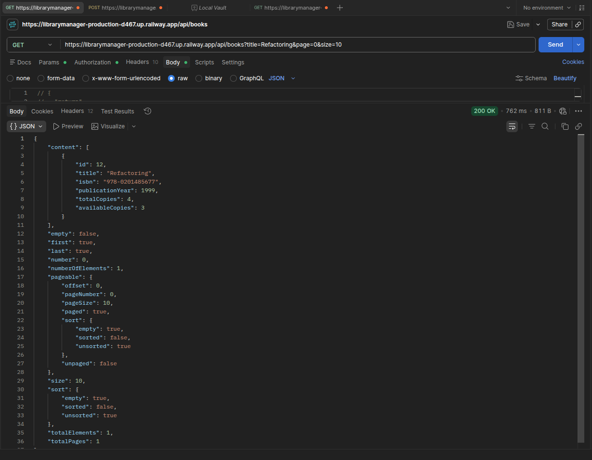

# librarymanager
<p align="center">
  
</p>

<h1 align="center">Library Manager</h1>

<p align="center">
  
  
  
</p>

<p align="center">
  <strong>API REST para gestão de acervos, com regras de negócio de empréstimo/multa desenvolvidas via TDD.</strong>
</p>

<p align="center">
  🚀 <strong>Link do Deploy:</strong> <a href="https://librarymanager-production-d467.up.railway.app" target="_blank" rel="noopener noreferrer">Acesse o Sistema no Railway</a>
</p>

---

### 🔍 O Problema

Sistemas de biblioteca simples costumam parar no CRUD: cadastrar livro, cadastrar usuário, registrar empréstimo. O que separa isso de um sistema real são as regras que aparecem só quando o volume de uso cresce — o que acontece quando dois usuários tentam pegar o último exemplar disponível ao mesmo tempo? Quem garante que a multa por atraso é calculada de forma consistente, sem depender de lógica espalhada em múltiplos pontos do código? Como a API comunica pro cliente a diferença entre "esse recurso não existe" (erro de infraestrutura) e "essa ação viola uma regra do negócio" (erro semântico)?

O **Library Manager** foi construído para responder essas perguntas de forma testada e documentada — não como CRUD de exercício, mas como um sistema com regras de concorrência de estoque, cálculo financeiro e contrato de erro HTTP bem definido, guiado por TDD do início ao fim.

### 📸 Prova Visual de Regras de Negócio

#### 1. Ciclo de Empréstimo e Devolução

| Sucesso no Empréstimo (201) | Devolução com Cálculo de Multa (200) |
| :---: | :---: |
|  |  |
| `expectedReturnDate` calculada automaticamente como `loanDate + 14 dias` no momento do registro — a regra vive no service, não é responsabilidade do cliente da API calcular. | Multa de R$ 92,00 (46 dias × R$ 2,00/dia) persistida no banco. O cálculo usa `ChronoUnit.DAYS.between()` sobre a data prevista vs. a data real de devolução, coberto por teste unitário que verifica o valor exato, não só a presença de uma multa. |

#### 2. Validações de Segurança e Negócio (Fail-Fast)

| Tentativa de Livro Indisponível (422) | Empréstimo Duplicado (422) |
| :---: | :---: |
|  |  |
| `availableCopies == 0` é validado no service antes de decrementar o contador — a API nunca deixa o estoque ir negativo. | `existsByBookIdAndUserIdAndStatus` bloqueia um segundo empréstimo ativo do mesmo livro pelo mesmo usuário. Ambos retornam **422**, não 400 ou 500: são violações de regra de negócio, não erro de validação de campo nem falha de infraestrutura. |

#### 3. Relatórios e Gestão Visual

| Dashboard Estratégico (Thymeleaf) | Filtros de Busca Avançados |
| :---: | :---: |
|  |  |
| Total de livros, empréstimos ativos, empréstimos em atraso e soma de multas — agregados via `LoanRepository` com queries JPQL dedicadas (`COUNT`, `SUM(COALESCE(...))`), não calculados em memória na aplicação. | Combinação de filtros (título + autor + disponibilidade) resolvida dinamicamente via `JPA Specification` — nenhuma explosão de métodos `findByTitleAndAuthorAndAvailable...` no repository. |

---

### 🧠 Decisões Técnicas e Trade-offs

- **TDD (Test-Driven Development):** cada regra de negócio (decremento de cópias, cálculo de multa, bloqueio de duplicata) foi escrita como teste que falha antes de existir no service. Isso trouxe um benefício concreto e não-óbvio: dois bugs de produção (detalhados abaixo) foram pegos exatamente porque o teste que os revelaria já existia — a suíte não subiu de repente, ela existia desde a primeira linha de código de cada feature.

- **JPA Specification vs. Query Methods:** rejeitei métodos derivados no Repository (`findByTitleAndAuthorAndAvailable`) porque esse padrão escala mal — cada combinação nova de filtro é um método novo. `JPA Specification` permite compor filtros dinamicamente com uma única implementação por critério, combinada em runtime conforme os parâmetros recebidos.

- **Tratamento de Exceções (404 vs 422):** um `GlobalExceptionHandler` central separa erro de infraestrutura de erro de negócio. Recurso inexistente → **404**. Violação de regra (livro indisponível, empréstimo duplicado) → **422 Unprocessable Entity**. Essa distinção é o que permite ao consumidor da API decidir a ação certa (repetir com outro ID vs. informar o usuário final que a operação não é permitida).

- **Autenticação com Spring Security + JWT (Stateless):** escolhida em vez de sessão tradicional para permitir escalabilidade horizontal sem estado compartilhado entre instâncias — qualquer réplica da aplicação valida o token independentemente, sem consultar um repositório de sessão centralizado.

- **Injeção de dependência via construtor no `JwtService`:** a chave de assinatura JWT (`secretKey`) é injetada via construtor e marcada `final`, não exposta por setter público. Um setter de classe existia originalmente só para viabilizar teste fora do contexto Spring — mas isso deixava qualquer código com referência ao bean livre para sobrescrever a chave em runtime. Documentado em [`docs/decisions.md`](docs/decisions.md) (ADR-001).

---

### 🐛 Bugs Reais Corrigidos (e o que eles ensinam)

Nenhum sistema sai perfeito da primeira implementação — o que importa é como o bug é encontrado e corrigido. Dois exemplos concretos:

**1. `JwtAuthenticationFilter` não capturava exceção de token inválido.** `extractUsername(token)` era chamado fora de um `try/catch`. Um token expirado ou malformado lançava `JwtException` não tratada, e o Spring respondia com **500 Internal Server Error** em vez de simplesmente tratar a requisição como não-autenticada. Em segurança, isso é uma violação do princípio de **fail closed, not fail open** — o sistema deve degradar para o estado mais restritivo em caso de erro, nunca vazar detalhes de uma falha interna. Corrigido envolvendo a extração em `try/catch`, com teste de regressão validado via mutation testing manual (reverti a correção, confirmei que o teste falhava, reapliquei).

**2. `returnLoan` calculava a multa mas não persistia a devolução.** O método atualizava `returnDate` e `status` no objeto em memória, mas não chamava `loanRepository.save(loan)` — a devolução "funcionava" na resposta HTTP, mas o banco continuava mostrando o empréstimo como ativo. Bug clássico de estado que parece correto no teste unitário com mock, mas quebra em integração real.

---

### 🐘 Como Rodar Localmente

**Pré-requisitos:** Java 21, PostgreSQL, Maven (ou use o `./mvnw` incluso).

```bash
# 1. Crie o banco
psql -U postgres -c "CREATE DATABASE librarymanager_db;"

# 2. Configure as variáveis de ambiente
export DB_PASSWORD=sua_senha_aqui
export JWT_SECRET=uma_chave_secreta_de_pelo_menos_32_caracteres

# 3. Rode a aplicação
./mvnw spring-boot:run
```

A API sobe em `http://localhost:8080`. Para autenticar:

```bash
curl -X POST http://localhost:8080/api/auth/login \
  -H "Content-Type: application/json" \
  -d '{"email": "seu@email.com", "password": "sua-senha"}'
```

O token retornado vai no header `Authorization: Bearer <token>` das demais requisições.

> `DB_PASSWORD` e `JWT_SECRET` nunca são commitados — são lidos de variável de ambiente tanto localmente (via `export`, ou Run Configuration do IntelliJ) quanto em produção (Railway). Os testes usam H2 em memória, totalmente isolado do PostgreSQL de desenvolvimento, configurado em `application-test.properties`.

---

### 🔗 Projeto Complementar

Este é o primeiro de dois projetos do portfólio. O [**Notification Hub**](https://github.com/Andrey479/notification-hub) é um serviço satélite que consome a API pública da Open Library para enriquecer os livros cadastrados aqui, e roda jobs agendados para manter o status de empréstimos consistente — containerizado com Docker e testado com WireMock.

---

### 👨‍💻 Autor

**Andrey Oliveira**
Desenvolvedor Java/Spring Boot buscando minha primeira oportunidade na área — este projeto (e o [Notification Hub](https://github.com/Andrey479/notification-hub)) documentam minha jornada aplicando TDD, JWT e integração de sistemas em cenários próximos de produção real.

[](https://www.linkedin.com/in/andrey-oliveira-software)
[](https://github.com/Andrey479)

---
*Este projeto foi licenciado sob a [MIT License](LICENSE).*